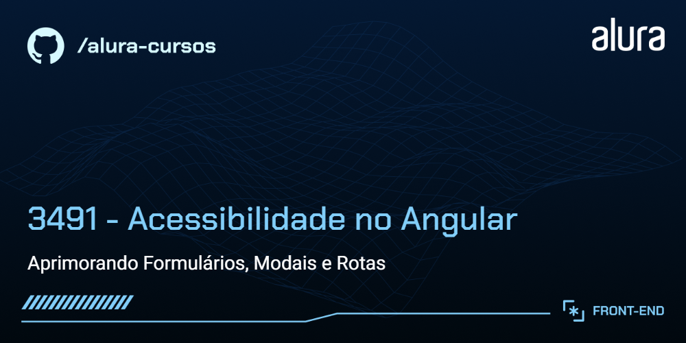

<p align="center">
  <a href="#about">Sobre</a>&nbsp;&nbsp;&nbsp;|&nbsp;&nbsp;&nbsp;  
  <a href="#technologies">Tecnologias usadas</a>&nbsp;&nbsp;&nbsp;|&nbsp;
  <a href="#preview">Prévia</a>&nbsp;&nbsp;&nbsp;|&nbsp;&nbsp;&nbsp;
  <a href="#rodar">Como rodar os testes</a>&nbsp;&nbsp;&nbsp;|&nbsp;&nbsp;&nbsp;
  <a href="#license">Licença</a>
</p>

<p align="center">
  

  

  
</p>

<a id="about"></a>

## :books: Sobre

O Buscante é uma aplicação que permite pesquisar e descobrir livros utilizando a API do Google Books. Onde é possivel:

- Pesquisar Livros

  - As pessoas podem inserir palavras-chave na barra de pesquisa para buscar livros de forma dinâmica.

- Ver detalhes do Livro

  - Ao clicar em um livro específico pode-se obter mais detalhes, como título, sinopse, autoria e outras informações fornecidas pela API do Google Books.

- Link para ler prévia do livro
  - Link com opção de ler uma prévia do livro.

O curso visa implementar estratégias de acessibilidade para tornar o Buscante uma aplicação mais inclusiva e acessível.

## ⚒️ Tecnologias usadas

- HTML
- CSS
- RxJs
- Angular
- Typescript
- Google Books API
- Angular Material

<a id="preview"></a><br>

## :tv: Prévia


<a id="rodar"></a><br>

## 🚀 Como rodar os testes

- Clonar este repositório

```
git clone https://github.com/RuthMaria/3491-angular-a11y-projeto-base.git
```

- Instalar as dependêncies

```
npm install
```

- Rodar o projeto

```
npm run start
```

<a id="license"></a><br>

## :memo: Licença

Este projeto está sob licença do MIT. Consulte o arquivo [LICENSE](LICENSE.md) para obter mais detalhes.

---

<h4 align="center">
    Desenvolvido com ❤️ por <a href="https://www.linkedin.com/in/ruth-maria-9b256071/" target="_blank">Ruth Maria</a>
</h4>
